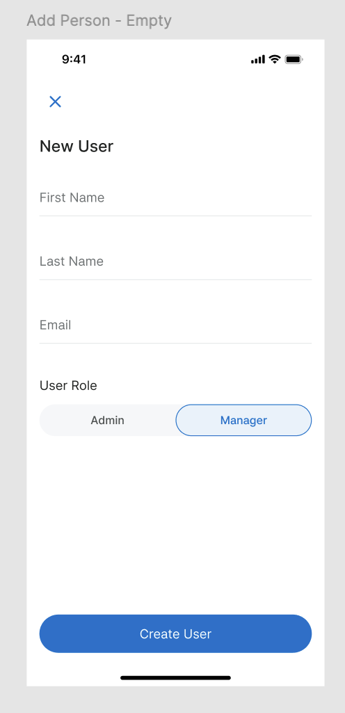

# Zeller React Native Code Challenge

## 1. Goal
Your goal is to build a React Native app that displays, filters, and manages a list of users. The application should integrate with a provided GraphQL endpoint and also support local data management using local storage.
We are most interested in how you structure your code, your use of TypeScript, and your approach to testing.

## 2. Requirements
- Fetch data from the listZellerCustomers GraphQL query (schema and connection details are in aws-exports.js and schema.gql).
- Store the fetched data into a local storage database (e.g. SQLite, Watermelon, Realm etc).
- Display the list of users from local storage, not directly from the network.
- Allow filtering users by user type (Admin, Manager).
- Allow adding new users and saving them to the local database. (No need to call Mutation/API)
- Your app should run on iOS or Android.
- Tests are VERY important.
- Make sure to have clean and readable source code.

## 3. Bonus Points

These features are absolutely not required, however if you finish your project early and wish to continue, here are some ideas

- Implemenent a text search box that filters users by name
- Implement a pull to refresh on the list
- Support updating and deleting users from the local database.
 

## 4. Designs

